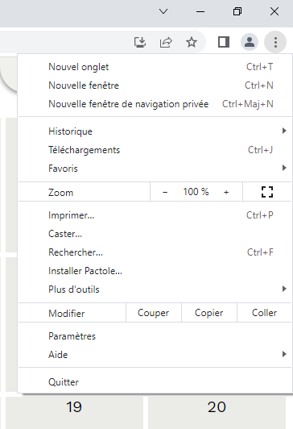
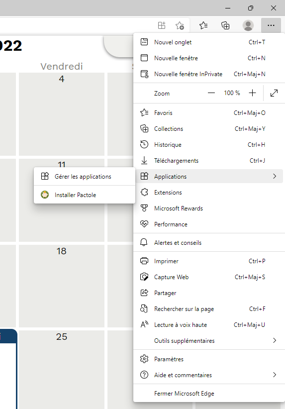

# Installation de Pactole

Pactole se présente comme une page web, mais se comporte comme une application:
après la première visite sur la page, celle-ci reste accessible même sans accès
internet. De plus, aucune donnée utilisateur n'est envoyée sur le réseau: tout
est enregistré en local, sur l'ordinateur de l'utilisateur (dans la base de
données du navigateur).

> **IMPORTANT: il ne faut jamais utiliser la fonctionnalité de nettoyage des
> données du navigateur.** En effet, les données de Pactole ne sont pas
> sauvegardées sur un site en ligne, mais gérées directement par le navigateur,
> sur l'ordinateur de l'utilisateur. Utiliser cette fonctionnalité effacerait
> donc toutes les opérations entrées dans l'application.

Afin de s'assurer que le navigateur préserve les données même en cas
d'inutilisation prolongée (par exemple plusieurs mois sans ouvrir la page
Pactole), une étape supplémentaire est conseillée lors de la première visite sur
la page. Cette étape différe suivant le navigateur utilisé.

## Installation avec Firefox

1. Visiter la page [https://drakmaniso.github.io/pactole/](https://drakmaniso.github.io/pactole/)

2. Une petite fenêtre de dialogue s'ouvre juste en dessous de la barre
d'addresse, demandant l'autorisation de "conserver les données dans le stockage
persistant".

3. Cliquer sur "Autoriser".

## Installation avec Google Chrome

1. Visiter la page [https://drakmaniso.github.io/pactole/](https://drakmaniso.github.io/pactole/)

2. Ouvrir le menu de Chrome et choisir "Installer Pactole...":

## Installation avec Microsoft Edge

1. Visiter la page [https://drakmaniso.github.io/pactole/](https://drakmaniso.github.io/pactole/)

2. Ouvrir le menu de Edge, aller dans le sous-menu "Applications" et choisir "Installer Patcole":

---
[Retour](index.md)